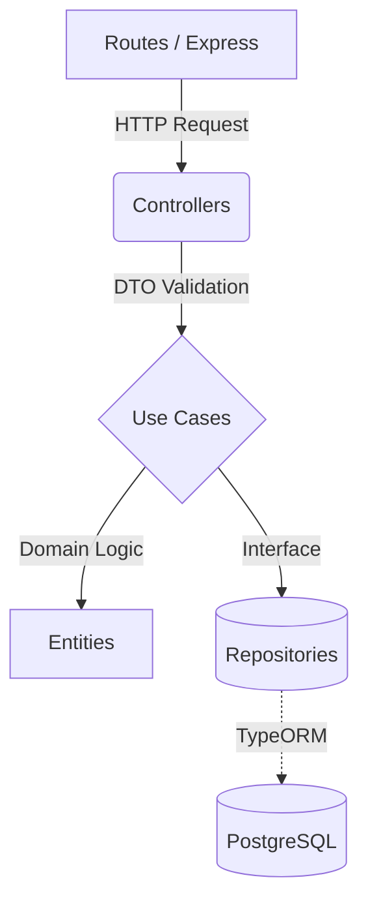

<h1 align="center">Order API (Clean Architecture)</h1>

<p align="center">
  
  
  
  
  
  
</p>

## 📖 Overview

A robust, highly scalable RESTful API designed to manage orders, leveraging **Clean Architecture** and **SOLID** principles. This project serves as a concrete implementation of modern software architecture practices, emphasizing domain isolation, dependency inversion, and strict data validation.

## 🏗️ Architecture & Design Patterns

The system is decoupled into well-defined layers, ensuring that the core business logic (Domain) remains entirely agnostic of external frameworks (UI, Database).

### Core Highlights
- **Clean Architecture:** Strict separation between `Domain`, `Use Cases`, `Interfaces`, and `Infrastructure`.
- **Dependency Injection (DI):** Utilizes `tsyringe` to invert dependencies, drastically improving testability and modularity.
- **Strict Validation:** Schemas are rigorously validated at the controller level using `zod`.
- **Data Persistence:** Relies on `TypeORM` with `PostgreSQL`, utilizing migrations for safe schema evolution.
- **Documentation:** Fully documented endpoints using `Swagger` (OpenAPI).



## 🚀 Getting Started

### Prerequisites
- Node.js (v22.x)
- Docker & Docker Compose

### Running locally
1. Clone the repository and install dependencies:
```bash
npm install
```
2. Copy the environment variables:
```bash
cp .env.example .env
```
3. Spin up the database via Docker:
```bash
npm run docker:up
```
4. Run database migrations:
```bash
npm run migration:run
```
5. Start the development server:
```bash
npm run dev
```

The API will be available at `http://localhost:3000`. You can access the Swagger documentation at `http://localhost:3000/api-docs`.

## 🧪 Testing
The project features a comprehensive suite of unit and integration tests using `Jest`.

```bash
# Run tests
npm run test

# Run tests with coverage report
npm run test:cov
```
