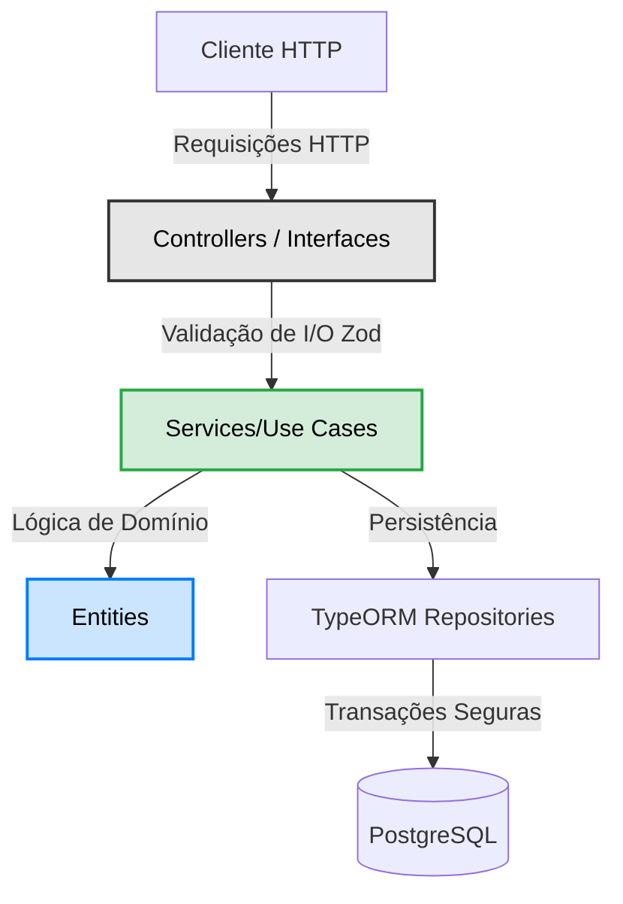

<div align="center">
  
  <h1>🛒 Order API Enterprise</h1>
  <p><strong>Motor de E-commerce Server-Side em Clean Architecture</strong></p>
  
  <p>
    
    
    
    
    
  </p>

  <p>
    <em>Uma API RESTful robusta, criada com princípios SOLID, segurança de padrão empresarial e foco em escalabilidade para operações complexas de comércio virtual.</em>
  </p>
</div>

<br />

> [!NOTE]
> **Status:** Atualmente operando com sucesso em ambiente de produção (Live).

---

## ⚡ Por que este repositório é diferenciado?
Este projeto não foi construído como um "side-project" comum. Ele orquestra os pilares críticos de vendas online empregando padrões avançados:

1. **Agnóstico e Resiliente**: Separação total através de **Clean Architecture**, fazendo com que regras de negócio pudessem operar sem depender do framework Express.
2. **Segurança Extrema (Zero Trust)**: 
   - Autenticação e Autorização via JWT criptografados.
   - Camadas de mitigação de abusos usando Rate-Limiting contextual (ex: maior restrição `/auth` menor no catálogo).
   - Sanitização agressiva contra SQL Injection e políticas restritas de CSP/CORS gerenciadas via Helmet e Zod.
3. **Assinaturas Financeiras**: Tratamento automatizado de webhooks (IPN) integrados ao **Mercado Pago**, com atualização em tempo-real do status da compra.
4. **Filtros de Alta Performance**: Implementação de indexação personalizada para produtos em destaque (`isFeatured`), garantindo filtragem ultra-rápida no banco de dados para vitrines principais.

---

## 📚 Base de Conhecimento

A API conta com manuais extensos para onboarding da equipe técnica:

| Recurso | Detalhes | Acesso Rápido |
| :--- | :--- | :--- |
| 🏗️ **Arquitetura** | Decisões técnicas, SOLID, Clean Arch e Fluxo de Dados. | [Ler Documentação](docs/ARCHITECTURE.md) |
| 🛡️ **Segurança** | Protocolos de defesa, Rate Limits, CSP e Auditoria. | [Ler Documentação](docs/SECURITY.md) |
| 🔌 **Integrações** | Guias detalhados de Mercado Pago e Webhooks. | [Ler Documentação](docs/API.md) |
| 🚀 **Deploy** | Configurações de Docker, Railway e Migrations. | [Ler Documentação](docs/DEPLOYMENT.md) |

---

## 🧩 Visão da Arquitetura

O core transacional flui perfeitamente com separação rígida de camadas.



---

## 🚀 Como Iniciar

### 1. Clonar e Configurar
```bash
git clone https://github.com/andsantosx/order-api.git
cd order-api

# O arquivo .env jamais deve ser versionado! (Use de modelo)
cp .env.example .env
npm install
```

### 2. Ambientes Isolados
Para rodar livre de configurações adicionais em sua máquina, uma infraestrutura de banco via Docker Compose está disposta.
```bash
# Subir o banco PostgreSQL Isolado
npm run docker:up

# Rodar a API em Watch Mode com recarregamento (SWC)
npm run dev

# Popular banco de dados para testes
npm run migration:run
npm run seed
```

### 3. Operando as Filas e Webhooks Localmente
Durante desenvolvimento de gatilhos financeiros, o projeto aguarda postbacks na rota `/api/payments/webhook`.

---

## 🧪 Qualidade Garantida

A integridade do código é regida por testes e um rigoroso pipeline manual acionado pelo lint moderno.

- `npm test`: Suite unificada em Jest com ambiente virtual isolado.
- `npm test:cov`: Geração de relatório de cobertura de regras de negócios.
- `npm run lint`: ESLint + Prettier atuando sob Strict Mode.

---

<div align="center">
  <sub>Criado de forma artesanal e segura por <a href="https://github.com/andsantosx">Anderson Santos</a>.</sub>
</div>
