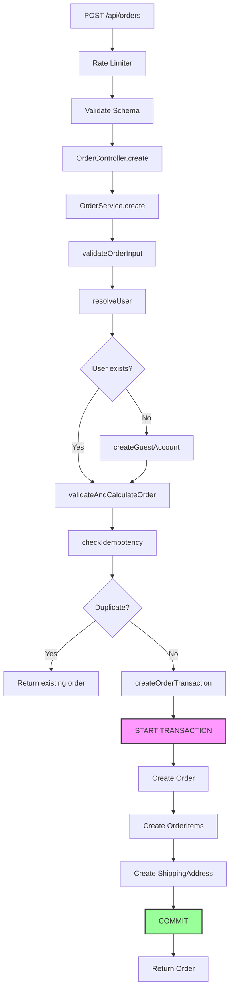
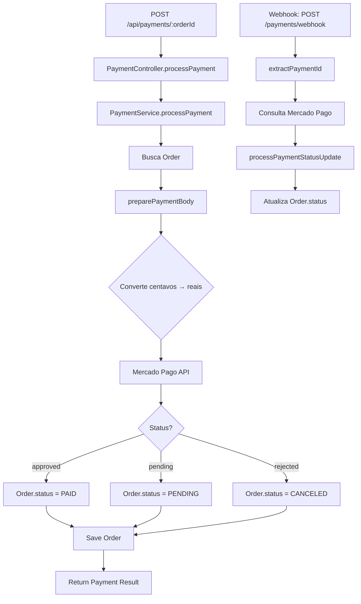

# Arquitetura - Order API

## Visão Geral

Esta é uma API RESTful para gerenciamento de e-commerce, construída com **Node.js**, **TypeScript**, **Express** e **TypeORM** com banco de dados **PostgreSQL**. Integra-se ao **Mercado Pago** para processamento de pagamentos.

### Princípios Arquiteturais

1. **Separação de Responsabilidades** - Camadas bem definidas (Controllers, Services, Entities, Middlewares)
2. **Type Safety** - TypeScript strict mode, zero `any` types
3. **SOLID Principles** - Especialmente Single Responsibility e Dependency Inversion
4. **Security First** - Rate limiting, input validation, sanitization, secure defaults
5. **Observabilidade** - Logging estruturado com Winston
6. **Transações Atômicas** - Operações críticas em transações de banco de dados

---

## Estrutura de Diretórios

```
src/
├── api/
│   ├── controllers/      # Camada de apresentação (HTTP handlers)
│   ├── entities/         # Entidades TypeORM (modelos de dados)
│   ├── middlewares/      # Middlewares Express (auth, validation, error handling)
│   ├── routes/           # Definições de rotas
│   ├── schemas/          # Schemas Zod para validação de input
│   ├── services/         # Lógica de negócio
│   ├── domain/           # Camada de domínio (DDD)
│   │   ├── events/       # Eventos de domínio
│   │   └── value-objects/# Objetos de valor
│   ├── mappers/          # Conversores entre camadas (DTO ↔ Entity)
│   ├── jobs/             # Jobs assíncronos e agendados
│   ├── exceptions/       # Exceções customizadas
│   ├── subscribers/      # Subscribers do TypeORM
│   └── validations/      # Validações de regras de negócio
├── config/               # Configurações (env, logger, mercadopago, rate limits)
├── constants/            # Constantes da aplicação
├── migrations/           # Migrations do banco de dados
├── types/                # Tipos TypeScript customizados
├── utils/                # Utilitários (sanitizer, transactions, validators)
├── tests/                # Testes (integration, unit, seed)
├── data-source.ts        # Configuração TypeORM
├── app.ts                # Configuração do Express
└── server.ts             # Entry point da aplicação
```

---

## Camadas da Aplicação

### 1. Routes (Roteamento)

**Responsabilidade**: Mapear URLs para controllers e aplicar middlewares

**Exemplo**:

```typescript
// authRoutes.ts
router.post(
  "/login",
  authLimiter, // Rate limiting
  validate(loginSchema), // Validação de input
  authController.login, // Handler
);
```

**Middlewares Aplicados**:

- `authLimiter` - Rate limiting específico
- `validate()` - Validação Zod
- `authMiddleware` - Autenticação JWT (rotas protegidas)
- `isAdmin` - Autorização de admin

---

### 2. Controllers (Camada de Apresentação)

**Responsabilidade**:

- Receber requisições HTTP
- Extrair dados do request (body, params, query)
- Chamar services
- Formatar respostas HTTP

**Padrão**:

```typescript
class OrderController {
    async create(req: Request, res: Response) {
        const userId = req.user?.id;
        const { items, shippingAddress, ... } = req.body;

        const order = await orderService.create(userId, ...);

        return res.status(201).json(order);
    }
}
```

**Não fazem**: Lógica de negócio, acesso direto ao banco de dados

---

### 3. Services (Lógica de Negócio)

**Responsabilidade**:

- Implementar regras de negócio
- Coordenar operações entre múltiplas entidades
- Validações complexas
- Transações de banco de dados

**Exemplo - OrderService**:

```typescript
class OrderService {
    // Método público - orquestra o fluxo
    async create(...): Promise<Order> {
        this.validateOrderInput(...);
        const user = await this.resolveUser(...);
        const { totalAmount } = await this.validateAndCalculateOrder(...);
        const existing = await this.checkIdempotency(...);
        if (existing) return existing;

        return await this.createOrderTransaction(...);
    }

    // Métodos privados - responsabilidades únicas
    private validateOrderInput(...): void { }
    private async resolveUser(...): Promise<User> { }
    private async validateAndCalculateOrder(...) { }
    private async checkIdempotency(...): Promise<Order | null> { }
    private async createOrderTransaction(...): Promise<Order> { }
}
```

**Características**:

- Métodos públicos: interface clara e concisa
- Métodos privados: lógica interna bem organizada
- Uso de transações para operações críticas
- Logging estruturado
- Uso de constantes para valores de negócio

---

### 4. Entities (Modelos de Dados)

**Responsabilidade**: Representar tabelas do banco de dados

**Tecnologia**: TypeORM com decorators

**Exemplo**:

```typescript
@Entity("orders")
export class Order {
  @PrimaryGeneratedColumn("uuid")
  id!: string;

  @ManyToOne(() => User)
  @JoinColumn({ name: "user_id" })
  user!: User;

  @Column({ type: "bigint" })
  total_amount!: number; // Em centavos

  @Column({ type: "enum", enum: OrderStatus })
  status!: OrderStatus;

  @CreateDateColumn()
  created_at!: Date;

  @OneToMany(() => OrderItem, (item) => item.order, { cascade: true })
  items!: OrderItem[];
}
```

**Convenções**:

- Nomes de colunas em `snake_case` (PostgreSQL convention)
- Propriedades TypeScript em `camelCase`
- Valores monetários sempre em **centavos** (bigint)
- Relações bem definidas com cascade onde apropriado

**Entidades do Sistema**:

| Entidade | Responsabilidade |
|---|---|
| `User` | Usuários do sistema (clientes e admins) |
| `Product` | Produtos do catálogo (com suporte a customização) |
| `Order` | Pedidos realizados |
| `OrderItem` | Itens de cada pedido (com customização opcional) |
| `Category` | Categorias de produtos |
| `Brand` | Marcas de produtos |
| `Size` | Tamanhos disponíveis |
| `ProductSize` | Relação produto-tamanho com estoque |
| `ProductImage` | Imagens dos produtos |
| `ShippingAddress` | Endereço de entrega do pedido |
| `UserAddress` | Endereços salvos do usuário |
| `Wishlist` | Lista de desejos do usuário |
| `ContactMessage` | Mensagens de contato enviadas |
| `Status` | Status centralizados do sistema |
| `OrderStatusHistory` | Histórico de mudanças de status do pedido |
| `AdminAuditLog` | Log de auditoria de ações administrativas |
| `EmailVerification` | Tokens de verificação de email |

---

### 5. Middlewares

#### Authentication (`authMiddleware`)

```typescript
// Valida JWT token
// Anexa user ao request: req.user
// Lança AppError se token inválido
```

#### Authorization (`isAdmin`)

```typescript
// Verifica se req.user.isAdmin === true
// Usado após authMiddleware
```

#### Validation (`validate`)

```typescript
// Valida req.body usando schemas Zod
// Retorna 400 com erros detalhados se inválido
```

#### Error Handler (`errorHandler`)

```typescript
// Captura todos os erros da aplicação
// Formata resposta consistente
// Loga erros com Winston
// Oculta stack traces em produção
```

#### Rate Limiting

```typescript
// authLimiter - 5 req/15min (login/register)
// orderCreationLimiter - 10 req/1h
// paymentProcessingLimiter - 5 req/15min
// generalLimiter - 100 req/15min (baseline)
```

---

## Fluxos Principais

### Fluxo de Criação de Pedido



**Pontos-Chave**:

1. **Idempotência**: Previne pedidos duplicados (30s window)
2. **Auto-signup**: Cria conta automaticamente para guests
3. **Transação Atômica**: Order + Items + Address salvos juntos
4. **Cálculo de Custo**: Verificar se o custo adicional de R$ 25,00 é aplicado corretamente
5. **Validações**: CEP, limites de valor, quantidade de items
6. **Flexibilidade de Tamanho**: Suporte a IDs numéricos (traduzidos dinamicamente para nomes no DB)

---

### Fluxo de Pagamento



**Pontos-Chave**:

1. **Conversão Monetária**: Centavos (DB) ↔ Reais (Mercado Pago)
2. **Webhooks**: Atualização assíncrona de status
3. **Idempotência**: Mercado Pago garante via payment_id
4. **Logging**: Todas as interações com MP são logadas

---

### Recursos Avançados Implementados

#### 1. Customização de Produtos

O sistema permite customização de produtos com custo adicional:

```typescript
// Produto com customização
{
  "productId": "uuid",
  "size": "M",
  "quantity": 2,
  "customization": "Nome na camisa: João Silva"
}

// Custo adicional aplicado: R$ 25,00 por item
```

**Características**:
- Custo de customização (R$ 25,00) é fixo e definido em `constants/index.ts`.
- Customização é opcional
- Texto livre para personalização
- Custo calculado e separado no total do pedido

#### 2. Sistema de Auditoria

Todas as ações administrativas são registradas:

```typescript
// AdminAuditLog
{
  "admin_id": "uuid",
  "action": "UPDATE_ORDER_STATUS",
  "entity_type": "Order",
  "entity_id": "order-uuid",
  "details": { "from": "PAID", "to": "SHIPPED" },
  "timestamp": "2024-04-29T10:00:00Z"
}
```

**Ações Auditadas**:
- Criação/Edição/Exclusão de produtos
- Mudanças de status de pedidos
- Reembolsos processados
- Alterações em usuários
- Configurações do sistema

#### 3. Histórico de Status de Pedidos

Cada mudança de status é rastreada:

```typescript
// OrderStatusHistory
{
  "order_id": "uuid",
  "from_status": "PAID",
  "to_status": "SHIPPED",
  "changed_by": "admin-uuid",
  "notes": "Pedido enviado via Correios - código RA123456789BR",
  "timestamp": "2024-04-29T10:00:00Z"
}
```

**Benefícios**:
- Rastreabilidade completa
- Identificação de quem fez a mudança
- Notas adicionais para contexto
- Timeline visual para o cliente

#### 4. Comunicação em Tempo Real (Socket.io)

WebSocket para notificações instantâneas:

```typescript
// Eventos emitidos
io.to(`user:${userId}`).emit('orderStatusUpdate', {
  orderId,
  newStatus: 'SHIPPED',
  trackingCode: 'RA123456789BR'
});
```

**Casos de Uso**:
- Atualização de status de pedido
- Confirmação de pagamento
- Notificações de promoções
- Alertas administrativos

#### 5. Sistema de Wishlist

Usuários podem salvar produtos favoritos:

```typescript
// Adicionar à wishlist
POST /api/wishlist
{
  "productId": "uuid",
  "size": "M"
}
```

**Funcionalidades**:
- Adicionar/Remover produtos
- Visualizar lista completa
- Notificações de promoções em produtos da wishlist

#### 6. Emails Transacionais

Sistema automatizado de emails via Mailjet:

**Emails Enviados**:
- **Confirmação de Pedido**: Detalhes do pedido, itens, total
- **Credenciais de Auto-signup**: Email e senha para guests
- **Pedido Enviado**: Código de rastreio e prazo de entrega
- **Status Atualizado**: Notificações de mudanças importantes
- **Verificação de Email**: Token de confirmação

**Template Dinâmico**:
- Logo e branding
- Detalhamento de itens com imagens
- Breakdown de preços (subtotal, customização, frete)
- Links para rastreamento
- Informações de contato

#### 7. Verificação de Email

Sistema de confirmação de email:

```typescript
// EmailVerification
{
  "user_id": "uuid",
  "token": "random-secure-token",
  "expires_at": "2024-04-30T10:00:00Z",
  "verified_at": null
}
```

**Fluxo**:
1. Token gerado no registro
2. Email enviado com link de confirmação
3. Usuário clica no link
4. Email verificado e marcado como confirmado

---

## Segurança

### 1. Autenticação e Autorização

**JWT**:

- Secret com mínimo 32 caracteres (validado no startup)
- Expiration: 1 dia (configurável em `SECURITY.JWT_EXPIRATION`)
- Token em header: `Authorization: Bearer <token>`

**Senha**:

- Hash: bcrypt com 10 rounds
- Senhas de auto-signup: 16 caracteres aleatórios

### 2. Rate Limiting

| Endpoint               | Limite    | Proteção Contra              |
| ---------------------- | --------- | ---------------------------- |
| `/auth/login`          | 5/15min   | Brute force                  |
| `/auth/register`       | 5/15min   | Spam de contas               |
| `/orders` (POST)       | 10/1h     | Spam de pedidos              |
| `/payments/:id` (POST) | 5/15min   | Abuso de pagamentos          |
| `/products` (GET)      | 30/1min   | Scraping                     |
| `/contact` (POST)      | 5/15min   | Spam de mensagens            |
| `/wishlist` (POST)     | 30/15min  | Abuso de wishlist            |
| Geral                  | 100/15min | Abuso geral                  |

**Configuração**: Variáveis de ambiente (`.env`)

### 3. Validação e Sanitização

**Input Validation** (Zod):

```typescript
// Todos os endpoints validam input
router.post('/orders', validate(orderSchema), ...)
```

**Sanitização**:

- HTML/Scripts removidos de todos os campos de texto
- URLs de imagem: whitelist de domínios permitidos
- CEP/CPF: formatação normalizada
- Email: lowercase + trim

**Domínios de Imagem Permitidos**:

```typescript
[
  "https://res.cloudinary.com",
  "https://images.unsplash.com",
  "https://i.imgur.com",
];
```

### 4. Proteções Implementadas

| Vulnerabilidade             | Proteção                              |
| --------------------------- | ------------------------------------- |
| **SQL Injection**           | TypeORM Query Builder (parametrizado) |
| **XSS**                     | Sanitização HTML em todos os inputs   |
| **CSRF**                    | CORS configurado, SameSite cookies    |
| **Brute Force**             | Rate limiting agressivo em auth       |
| **SSRF**                    | Whitelist de domínios de imagem       |
| **Sensitive Data Exposure** | Logs estruturados sem senhas/tokens   |

---

## Observabilidade

### Logging Estruturado (Winston)

**Níveis**:

- `error` - Erros que impedem operação
- `warn` - Situações anormais mas recuperáveis
- `info` - Eventos importantes (pedido criado, pagamento processado)
- [📢 API Reference](docs/API.md)
- [🏗️ Arquitetura](docs/ARCHITECTURE.md)
- [🔒 Segurança](docs/SECURITY.md)
- [🧪 Guia de Testes](docs/TESTING.md)
- [🚀 Manual de Deploy](docs/DEPLOYMENT.md)
- [✨ Guia de Contribuição](docs/CONTRIBUTING.md)
- `debug` - Detalhes técnicos (desenvolvimento)

**Formato**:

```typescript
log.info("Pedido criado com sucesso", {
  orderId: order.id,
  userId: user.id,
  total: totalAmount,
});
```

**Logs Importantes**:

- Autenticação (login, falhas)
- Criação de pedidos
- Processamento de pagamentos
- Webhooks recebidos
- Erros de API externa (Mercado Pago)

**Produção**: JSON formatado para indexação (ELK, CloudWatch, etc)

---

## Transações de Banco de Dados

### Helper `executeInTransaction`

```typescript
const order = await executeInTransaction(async (manager) => {
  const order = await manager.save(Order, orderData);
  const items = await manager.save(OrderItem, itemsData);
  const address = await manager.save(ShippingAddress, addressData);
  return order;
});
```

**Garantias**:

- Atomicidade: tudo ou nada
- Rollback automático em caso de erro
- Liberação automática de recursos
- Logging de transações

**Usado Em**:

- Criação de pedidos (Order + Items + Address)
- Operações complexas que envolvem múltiplas tabelas

---

## Camada de Domínio (DDD)

### Domain Events (`src/api/domain/events`)

Eventos de domínio representam fatos que aconteceram no sistema:

```typescript
// Exemplo de evento
OrderPaidEvent {
  orderId: string;
  userId: string;
  totalAmount: number;
  occurredAt: Date;
}
```

**Uso**:
- Desacoplamento entre módulos
- Histórico de eventos (Event Sourcing parcial)
- Triggers para ações assíncronas (emails, notificações)

### Value Objects (`src/api/domain/value-objects`)

Objetos de valor imutáveis que representam conceitos do domínio:

```typescript
// Exemplo
Money {
  amount: number; // Em centavos
  currency: string; // 'BRL'
  
  add(other: Money): Money
  subtract(other: Money): Money
  toReais(): number
}
```

**Características**:
- Imutáveis
- Sem identidade própria
- Validação interna
- Comportamento rico

### Mappers (`src/api/mappers`)

Conversão entre diferentes representações:

```typescript
// DTO → Entity
OrderMapper.toEntity(orderDTO): Order

// Entity → Response DTO
OrderMapper.toResponse(order): OrderResponseDTO
```

**Benefícios**:
- Separação clara de camadas
- Evita vazamento de detalhes de implementação
- Facilita mudanças de estrutura

---

## Regras de Negócio Centralizadas

### Constantes (`src/constants/index.ts`)

```typescript
export const MONEY = {
  CENTS_PER_REAL: 100,
  MIN_ORDER_VALUE_CENTS: 0, // R$ 0,00
  MAX_ORDER_VALUE_CENTS: 5000000, // R$ 50.000,00
  CUSTOMIZATION_COST_CENTS: 2500, // R$ 25,00
};

export const SHIPPING = {
  FIXED_SHIPPING_COST_CENTS: 0, // FRETE GRÁTIS
  FREE_SHIPPING_THRESHOLD_CENTS: 0, // R$ 0,00
  ESTIMATED_DELIVERY_DAYS: 7,
};

export const ORDER = {
  IDEMPOTENCY_WINDOW_SECONDS: 30,
  MIN_ITEM_QUANTITY: 1,
  MAX_ITEM_QUANTITY: 99,
  MAX_ITEMS_PER_ORDER: 50,
};
```

**Benefícios**:

- Sem "magic numbers" no código
- Regras fáceis de ajustar
- Documentação implícita via nomes descritivos
- Type-safe com `as const`

---

## Serviços do Sistema

A aplicação implementa os seguintes serviços de negócio:

| Service | Responsabilidade |
|---|---|
| `OrderService` | Criação e gerenciamento de pedidos, cálculo de valores, idempotência |
| `PaymentService` | Integração com Mercado Pago, processamento de pagamentos e webhooks |
| `ProductService` | CRUD de produtos, filtragem, destaque, customização |
| `UserService` | Autenticação, registro, auto-signup de guests |
| `EmailService` | Envio de emails transacionais (Mailjet), confirmações, credenciais |
| `SocketService` | Comunicação em tempo real com Socket.io, notificações |
| `WishlistService` | Gerenciamento de lista de desejos |
| `AddressService` | Gerenciamento de endereços de usuário |
| `CategoryService` | CRUD de categorias |
| `BrandService` | CRUD de marcas |
| `SizeService` | Gerenciamento de tamanhos |
| `ShippingService` | Cálculo de frete e prazos de entrega |
| `ContactService` | Processamento de mensagens de contato |
| `StatsService` | Estatísticas e dashboards administrativos |
| `AuditService` | Log de auditoria de ações administrativas |
| `OrderHistoryService` | Histórico de mudanças de status de pedidos |
| `ImageService` | Validação e gerenciamento de imagens de produtos |
| `AdminService` | Operações administrativas diversas |

**Padrões dos Services**:
- Métodos públicos representam casos de uso
- Métodos privados encapsulam lógica interna
- Uso de transações para operações críticas
- Validações de negócio centralizadas
- Logging estruturado em todas as operações importantes

---

## Boas Práticas Implementadas

### 1. Type Safety

- ✅ Zero `any` types
- ✅ Strict TypeScript config
- ✅ Explicit return types em funções críticas
- ✅ Union types para estados (`OrderStatus`, `NodeEnvironment`)

### 2. Error Handling

- ✅ Classe `AppError` customizada
- ✅ Middleware global de erro
- ✅ Mensagens de erro descritivas e seguras
- ✅ HTTP status codes semânticos

### 3. Code Organization

- ✅ Métodos < 50 linhas
- ✅ Single Responsibility Principle
- ✅ Comentários JSDoc em português
- ✅ Nomes descritivos de variáveis e funções

### 4. Testing (Recomendado)

- Unit tests para services (Jest)
- Integration tests para endpoints
- Mock de APIs externas (Mercado Pago)
- Coverage mínimo: 80%

---

## Variáveis de Ambiente

### Obrigatórias

> [!DANGER]
> **REPOSITÓRIO PÚBLICO EM PRODUÇÃO**: **NUNCA** insira valores reais de produção em arquivos de documentação ou versionados no Git. Use sempre o arquivo `.env` (que deve estar no `.gitignore`). Os exemplos abaixo são apenas para referência - configure valores reais apenas via variáveis de ambiente no servidor.

```bash
DB_HOST=localhost      # Use 'db' para Docker
DB_PORT=5432
DB_NAME=sua_db_nome
DB_USER=seu_usuario
DB_PASSWORD=SUA_SENHA_SEGURA_AQUI
JWT_SECRET=GERAR_STRING_ALEATORIA_64_CHARS
MERCADOPAGO_ACCESS_TOKEN=SEU_TOKEN_MP_AQUI
```

### Opcionais (com defaults)

```bash
PORT=3000
NODE_ENV=development
FRONTEND_URL=http://localhost:5173

# Rate Limiting
RATE_LIMIT_GENERAL_WINDOW=900000    # 15min em ms
RATE_LIMIT_GENERAL_MAX=100
RATE_LIMIT_AUTH_WINDOW=900000
RATE_LIMIT_AUTH_MAX=5
RATE_LIMIT_ORDER_WINDOW=3600000     # 1h em ms
RATE_LIMIT_ORDER_MAX=10
RATE_LIMIT_PAYMENT_WINDOW=900000
RATE_LIMIT_PAYMENT_MAX=5
```

---

## Recursos Implementados ✅

1. ✅ **Testes Automatizados**: Suíte completa de testes de integração
2. ✅ **Audit Log**: Sistema completo de auditoria de ações administrativas
3. ✅ **Email Transacional**: Integração com Mailjet para emails automatizados
4. ✅ **Socket.io**: Comunicação em tempo real
5. ✅ **Histórico de Status**: Rastreamento completo de mudanças de pedido
6. ✅ **Wishlist**: Sistema de lista de desejos
7. ✅ **Customização de Produtos**: Produtos podem ser customizados com custo adicional de **R$ 25,00** por item
8. ✅ **Verificação de Email**: Sistema de confirmação de email
9. ✅ **Sistema de Contato**: Formulário de contato com persistência

## Próximas Melhorias Recomendadas

### Alta Prioridade

1. **Refresh Tokens**: Melhorar experiência de autenticação de longa duração
2. **Webhook Signatures**: Validar origem dos webhooks do Mercado Pago
3. **Controle de Estoque**: Sistema de gestão de estoque por variante/tamanho

### Média Prioridade

1. **Cache Layer**: Redis para queries frequentes (produtos, categorias)
2. **API Documentation**: Swagger/OpenAPI para documentação interativa
3. **Search Engine**: ElasticSearch ou Algolia para busca avançada de produtos
4. **Notificações Push**: Push notifications mobile/web

### Baixa Prioridade

1. **Metrics**: Prometheus/Grafana para monitoramento
2. **Background Jobs**: Bull/BullMQ para processamento assíncrono
3. **Feature Flags**: LaunchDarkly ou similar
4. **CDN**: CloudFlare ou similar para assets estáticos

---

## Dependências Principais

| Dependência        | Versão | Propósito            |
| ------------------ | ------ | -------------------- |
| express            | ^4.x   | Framework web        |
| typeorm            | ^0.3.x | ORM                  |
| pg                 | ^8.x   | Driver PostgreSQL    |
| typescript         | ^5.6.3 | Type safety (Stable) |
| @types/babel__core | ^7.20.5| Tipos implícitos p/ Babel |
| zod                | ^3.x   | Validação de schema  |
| winston            | ^3.x   | Logging estruturado  |
| bcryptjs           | ^2.x   | Hash de senhas       |
| jsonwebtoken       | ^9.x   | Autenticação JWT     |
| mercadopago        | ^2.x   | Gateway de pagamento |
| express-rate-limit | ^7.x   | Rate limiting        |
| helmet             | ^7.x   | Security headers     |
| cors               | ^2.x   | CORS configuration   |

---

# Comandos Úteis (Ambiente Docker)

```bash
# Desenvolvimento
npm run dev          # Inicia servidor com hot-reload

# Qualidade (Recomendado dentro do Docker)
docker exec order-api-app-1 npm run lint
docker exec order-api-app-1 npm run format

# Testes (Banco PostgreSQL isolado: order_db_test)
docker exec -e DB_HOST=db order-api-app-1 npm test

# Database
npm run typeorm migration:run
npm run seed         # Popula dados iniciais
```

---

## Conclusão

Esta arquitetura prioriza **segurança, manutenibilidade e escalabilidade**. Cada camada tem responsabilidades claras, o código é type-safe e bem documentado, e as regras de negócio estão explícitas.

**Princípios-Chave**:

1. **Separação de Responsabilidades** clara
2. **Type Safety** rigorosa
3. **Segurança** como prioridade
4. **Observabilidade** via logging estruturado
5. **Transações** para integridade de dados
6. **Constantes** para regras de negócio

Para dúvidas ou contribuições, consulte a documentação inline (JSDoc) no código-fonte.
