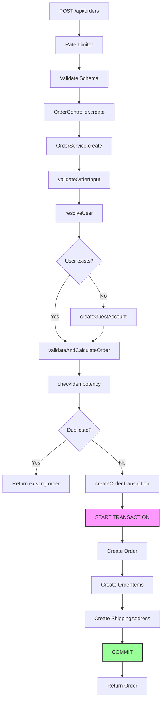
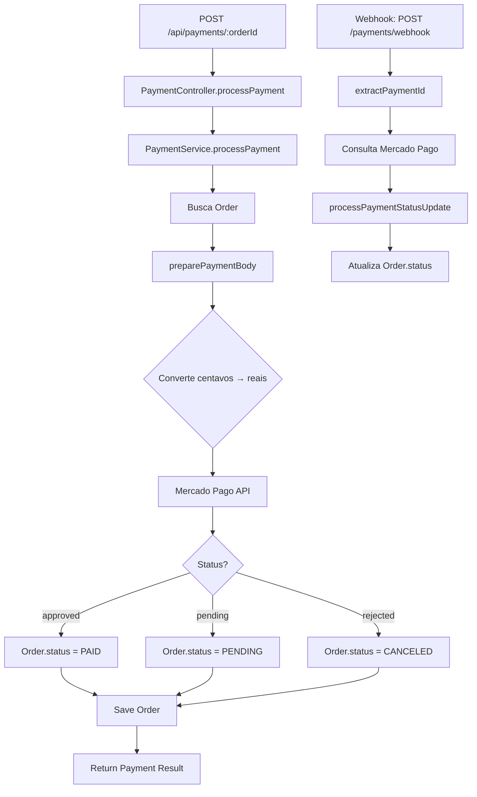

# Arquitetura - Order API

## Visão Geral

Esta é uma API RESTful para gerenciamento de e-commerce, construída com **Node.js**, **TypeScript**, **Express** e **TypeORM** com banco de dados **PostgreSQL**. Integra-se ao **Mercado Pago** para processamento de pagamentos.

### Princípios Arquiteturais

1. **Separação de Responsabilidades** - Camadas bem definidas (Controllers, Services, Entities, Middlewares)
2. **Type Safety** - TypeScript strict mode, zero `any` types
3. **SOLID Principles** - Especialmente Single Responsibility e Dependency Inversion
4. **Security First** - Rate limiting, input validation, sanitization, secure defaults
5. **Observabilidade** - Logging estruturado com Winston
6. **Transações Atômicas** - Operações críticas em transações de banco de dados

---

## Estrutura de Diretórios

```
src/
├── api/
│   ├── controllers/      # Camada de apresentação (HTTP handlers)
│   ├── entities/         # Entidades TypeORM (modelos de dados)
│   ├── middlewares/      # Middlewares Express (auth, validation, error handling)
│   ├── routes/           # Definições de rotas
│   ├── schemas/          # Schemas Zod para validação de input
│   └── services/         # Lógica de negócio
├── config/               # Configurações (env, logger, mercadopago, rate limits)
├── constants/            # Constantes da aplicação
├── types/                # Tipos TypeScript customizados
├── utils/                # Utilitários (sanitizer, transactions)
├── data-source.ts        # Configuração TypeORM
└── server.ts             # Entry point da aplicação
```

---

## Camadas da Aplicação

### 1. Routes (Roteamento)

**Responsabilidade**: Mapear URLs para controllers e aplicar middlewares

**Exemplo**:

```typescript
// authRoutes.ts
router.post(
  "/login",
  authLimiter, // Rate limiting
  validate(loginSchema), // Validação de input
  authController.login, // Handler
);
```

**Middlewares Aplicados**:

- `authLimiter` - Rate limiting específico
- `validate()` - Validação Zod
- `authMiddleware` - Autenticação JWT (rotas protegidas)
- `isAdmin` - Autorização de admin

---

### 2. Controllers (Camada de Apresentação)

**Responsabilidade**:

- Receber requisições HTTP
- Extrair dados do request (body, params, query)
- Chamar services
- Formatar respostas HTTP

**Padrão**:

```typescript
class OrderController {
    async create(req: Request, res: Response) {
        const userId = req.user?.id;
        const { items, shippingAddress, ... } = req.body;

        const order = await orderService.create(userId, ...);

        return res.status(201).json(order);
    }
}
```

**Não fazem**: Lógica de negócio, acesso direto ao banco de dados

---

### 3. Services (Lógica de Negócio)

**Responsabilidade**:

- Implementar regras de negócio
- Coordenar operações entre múltiplas entidades
- Validações complexas
- Transações de banco de dados

**Exemplo - OrderService**:

```typescript
class OrderService {
    // Método público - orquestra o fluxo
    async create(...): Promise<Order> {
        this.validateOrderInput(...);
        const user = await this.resolveUser(...);
        const { totalAmount } = await this.validateAndCalculateOrder(...);
        const existing = await this.checkIdempotency(...);
        if (existing) return existing;

        return await this.createOrderTransaction(...);
    }

    // Métodos privados - responsabilidades únicas
    private validateOrderInput(...): void { }
    private async resolveUser(...): Promise<User> { }
    private async validateAndCalculateOrder(...) { }
    private async checkIdempotency(...): Promise<Order | null> { }
    private async createOrderTransaction(...): Promise<Order> { }
}
```

**Características**:

- Métodos públicos: interface clara e concisa
- Métodos privados: lógica interna bem organizada
- Uso de transações para operações críticas
- Logging estruturado
- Uso de constantes para valores de negócio

---

### 4. Entities (Modelos de Dados)

**Responsabilidade**: Representar tabelas do banco de dados

**Tecnologia**: TypeORM com decorators

**Exemplo**:

```typescript
@Entity("orders")
export class Order {
  @PrimaryGeneratedColumn("uuid")
  id!: string;

  @ManyToOne(() => User)
  @JoinColumn({ name: "user_id" })
  user!: User;

  @Column({ type: "bigint" })
  total_amount!: number; // Em centavos

  @Column({ type: "enum", enum: OrderStatus })
  status!: OrderStatus;

  @CreateDateColumn()
  created_at!: Date;

  @OneToMany(() => OrderItem, (item) => item.order, { cascade: true })
  items!: OrderItem[];
}
```

**Convenções**:

- Nomes de colunas em `snake_case` (PostgreSQL convention)
- Propriedades TypeScript em `camelCase`
- Valores monetários sempre em **centavos** (bigint)
- Relações bem definidas com cascade onde apropriado

---

### 5. Middlewares

#### Authentication (`authMiddleware`)

```typescript
// Valida JWT token
// Anexa user ao request: req.user
// Lança AppError se token inválido
```

#### Authorization (`isAdmin`)

```typescript
// Verifica se req.user.isAdmin === true
// Usado após authMiddleware
```

#### Validation (`validate`)

```typescript
// Valida req.body usando schemas Zod
// Retorna 400 com erros detalhados se inválido
```

#### Error Handler (`errorHandler`)

```typescript
// Captura todos os erros da aplicação
// Formata resposta consistente
// Loga erros com Winston
// Oculta stack traces em produção
```

#### Rate Limiting

```typescript
// authLimiter - 5 req/15min (login/register)
// orderCreationLimiter - 10 req/1h
// paymentProcessingLimiter - 5 req/15min
// generalLimiter - 100 req/15min (baseline)
```

---

## Fluxos Principais

### Fluxo de Criação de Pedido



**Pontos-Chave**:

1. **Idempotência**: Previne pedidos duplicados (30s window)
2. **Auto-signup**: Cria conta automaticamente para guests
3. **Transação Atômica**: Order + Items + Address salvos juntos
4. **Cálculo de Frete**: Grátis acima de R$ 200
5. **Validações**: CEP, limites de valor, quantidade de items

---

### Fluxo de Pagamento



**Pontos-Chave**:

1. **Conversão Monetária**: Centavos (DB) ↔ Reais (Mercado Pago)
2. **Webhooks**: Atualização assíncrona de status
3. **Idempotência**: Mercado Pago garante via payment_id
4. **Logging**: Todas as interações com MP são logadas

---

## Segurança

### 1. Autenticação e Autorização

**JWT**:

- Secret com mínimo 32 caracteres (validado no startup)
- Expiration: 1 dia (configurável em `SECURITY.JWT_EXPIRATION`)
- Token em header: `Authorization: Bearer <token>`

**Senha**:

- Hash: bcrypt com 10 rounds
- Senhas de auto-signup: 16 caracteres aleatórios

### 2. Rate Limiting

| Endpoint               | Limite    | Proteção Contra     |
| ---------------------- | --------- | ------------------- |
| `/auth/login`          | 5/15min   | Brute force         |
| `/auth/register`       | 5/15min   | Spam de contas      |
| `/orders` (POST)       | 10/1h     | Spam de pedidos     |
| `/payments/:id` (POST) | 5/15min   | Abuso de pagamentos |
| `/products` (GET)      | 30/1min   | Scraping            |
| Geral                  | 100/15min | Abuso geral         |

**Configuração**: Variáveis de ambiente (`.env`)

### 3. Validação e Sanitização

**Input Validation** (Zod):

```typescript
// Todos os endpoints validam input
router.post('/orders', validate(orderSchema), ...)
```

**Sanitização**:

- HTML/Scripts removidos de todos os campos de texto
- URLs de imagem: whitelist de domínios permitidos
- CEP/CPF: formatação normalizada
- Email: lowercase + trim

**Domínios de Imagem Permitidos**:

```typescript
[
  "https://res.cloudinary.com",
  "https://images.unsplash.com",
  "https://i.imgur.com",
];
```

### 4. Proteções Implementadas

| Vulnerabilidade             | Proteção                              |
| --------------------------- | ------------------------------------- |
| **SQL Injection**           | TypeORM Query Builder (parametrizado) |
| **XSS**                     | Sanitização HTML em todos os inputs   |
| **CSRF**                    | CORS configurado, SameSite cookies    |
| **Brute Force**             | Rate limiting agressivo em auth       |
| **SSRF**                    | Whitelist de domínios de imagem       |
| **Sensitive Data Exposure** | Logs estruturados sem senhas/tokens   |

---

## Observabilidade

### Logging Estruturado (Winston)

**Níveis**:

- `error` - Erros que impedem operação
- `warn` - Situações anormais mas recuperáveis
- `info` - Eventos importantes (pedido criado, pagamento processado)
- `debug` - Detalhes técnicos (desenvolvimento)

**Formato**:

```typescript
log.info("Pedido criado com sucesso", {
  orderId: order.id,
  userId: user.id,
  total: totalAmount,
});
```

**Logs Importantes**:

- Autenticação (login, falhas)
- Criação de pedidos
- Processamento de pagamentos
- Webhooks recebidos
- Erros de API externa (Mercado Pago)

**Produção**: JSON formatado para indexação (ELK, CloudWatch, etc)

---

## Transações de Banco de Dados

### Helper `executeInTransaction`

```typescript
const order = await executeInTransaction(async (manager) => {
  const order = await manager.save(Order, orderData);
  const items = await manager.save(OrderItem, itemsData);
  const address = await manager.save(ShippingAddress, addressData);
  return order;
});
```

**Garantias**:

- Atomicidade: tudo ou nada
- Rollback automático em caso de erro
- Liberação automática de recursos
- Logging de transações

**Usado Em**:

- Criação de pedidos (Order + Items + Address)
- Operações complexas que envolvem múltiplas tabelas

---

## Regras de Negócio Centralizadas

### Constantes (`src/constants/index.ts`)

```typescript
export const MONEY = {
  CENTS_PER_REAL: 100,
  MIN_ORDER_VALUE_CENTS: 1000, // R$ 10,00
  MAX_ORDER_VALUE_CENTS: 5000000, // R$ 50.000,00
};

export const SHIPPING = {
  FIXED_SHIPPING_COST_CENTS: 1500, // R$ 15,00
  FREE_SHIPPING_THRESHOLD_CENTS: 20000, // R$ 200,00
  ESTIMATED_DELIVERY_DAYS: 7,
};

export const ORDER = {
  IDEMPOTENCY_WINDOW_SECONDS: 30,
  MIN_ITEM_QUANTITY: 1,
  MAX_ITEM_QUANTITY: 99,
  MAX_ITEMS_PER_ORDER: 50,
};
```

**Benefícios**:

- Sem "magic numbers" no código
- Regras fáceis de ajustar
- Documentação implícita via nomes descritivos
- Type-safe com `as const`

---

## Boas Práticas Implementadas

### 1. Type Safety

- ✅ Zero `any` types
- ✅ Strict TypeScript config
- ✅ Explicit return types em funções críticas
- ✅ Union types para estados (`OrderStatus`, `NodeEnvironment`)

### 2. Error Handling

- ✅ Classe `AppError` customizada
- ✅ Middleware global de erro
- ✅ Mensagens de erro descritivas e seguras
- ✅ HTTP status codes semânticos

### 3. Code Organization

- ✅ Métodos < 50 linhas
- ✅ Single Responsibility Principle
- ✅ Comentários JSDoc em português
- ✅ Nomes descritivos de variáveis e funções

### 4. Testing (Recomendado)

- Unit tests para services (Jest)
- Integration tests para endpoints
- Mock de APIs externas (Mercado Pago)
- Coverage mínimo: 80%

---

## Variáveis de Ambiente

### Obrigatórias

```bash
DATABASE_URL=postgresql://...
JWT_SECRET=<mínimo 32 caracteres>
MERCADOPAGO_ACCESS_TOKEN=<token do MP>
```

### Opcionais (com defaults)

```bash
PORT=3000
NODE_ENV=development
FRONTEND_URL=http://localhost:5173

# Rate Limiting
RATE_LIMIT_GENERAL_WINDOW=900000    # 15min em ms
RATE_LIMIT_GENERAL_MAX=100
RATE_LIMIT_AUTH_WINDOW=900000
RATE_LIMIT_AUTH_MAX=5
RATE_LIMIT_ORDER_WINDOW=3600000     # 1h em ms
RATE_LIMIT_ORDER_MAX=10
RATE_LIMIT_PAYMENT_WINDOW=900000
RATE_LIMIT_PAYMENT_MAX=5
```

---

## Próximas Melhorias Recomendadas

### Alta Prioridade

1. **Testes Automatizados**: Unit + Integration tests
2. **Email Service**: Envio de credenciais de auto-signup
3. **Refresh Tokens**: Melhorar experiência de autenticação

### Média Prioridade

1. **Audit Log**: Rastreabilidade de ações admin
2. **Webhook Signatures**: Validar origem dos webhooks MP
3. **Cache Layer**: Redis para queries frequentes
4. **API Documentation**: Swagger/OpenAPI

### Baixa Prioridade

1. **Metrics**: Prometheus/Grafana
2. **Background Jobs**: Bull/BullMQ para emails
3. **Feature Flags**: LaunchDarkly ou similar

---

## Dependências Principais

| Dependência        | Versão | Propósito            |
| ------------------ | ------ | -------------------- |
| express            | ^4.x   | Framework web        |
| typeorm            | ^0.3.x | ORM                  |
| pg                 | ^8.x   | Driver PostgreSQL    |
| typescript         | ^5.x   | Type safety          |
| zod                | ^3.x   | Validação de schema  |
| winston            | ^3.x   | Logging estruturado  |
| bcryptjs           | ^2.x   | Hash de senhas       |
| jsonwebtoken       | ^9.x   | Autenticação JWT     |
| mercadopago        | ^2.x   | Gateway de pagamento |
| express-rate-limit | ^7.x   | Rate limiting        |
| helmet             | ^7.x   | Security headers     |
| cors               | ^2.x   | CORS configuration   |

---

## Comandos Úteis

```bash
# Desenvolvimento
npm run dev          # Inicia servidor com hot-reload

# Build
npm run build        # Compila TypeScript
npm start            # Inicia servidor compilado

# Database
npm run typeorm migration:generate -- -n NomeDaMigracao
npm run typeorm migration:run
npm run seed         # Popula dados iniciais

# Qualidade
npm run lint         # ESLint
npm test             # Testes (quando implementados)
npm audit            # Verifica vulnerabilidades
```

---

## Conclusão

Esta arquitetura prioriza **segurança, manutenibilidade e escalabilidade**. Cada camada tem responsabilidades claras, o código é type-safe e bem documentado, e as regras de negócio estão explícitas.

**Princípios-Chave**:

1. **Separação de Responsabilidades** clara
2. **Type Safety** rigorosa
3. **Segurança** como prioridade
4. **Observabilidade** via logging estruturado
5. **Transações** para integridade de dados
6. **Constantes** para regras de negócio

Para dúvidas ou contribuições, consulte a documentação inline (JSDoc) no código-fonte.
