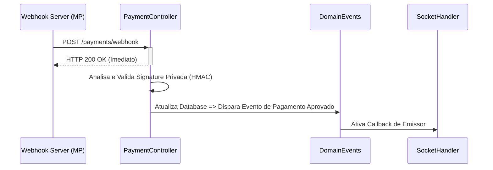

# 📡 Sincronia Complexa: Eventos, WebSockets e Webhooks

> [!NOTE]
> A Order API Enterprise brilha em seu gerenciamento operacional assíncrono. Em e-commerces, a latência entre o **Pix ser pago e a tela brilhar com a venda aprovada** define a credibilidade do checkout. Por isto, orquestramos um sistema formidável de troca de mensagens.

---

Neste documento mapeamos as arquiteturas reativas do nosso Domínio: Como recebemos faturamento no Background sem onerar a Thread Principal, e como repassamos as atualizações ao cliente utilizando canais Socket em tempo real.

## 1. Webhooks Financeiros (O Ponto de Entrada)

A API trabalha perfeitamente acoplada com gateways Enterprise — nesta versão, a escolha primária foi garantir portabilidade à rede **Mercado Pago (IPN - Instant Payment Notifications)**.

- **Entrada via HTTP**: Endpoints agnósticos na rota `/api/payments/webhook`, escudados pela camada externa do `express-rate-limit` mitigando "bombardeios de retentativa/Spam" vindos da internet. Ponto crítico onde apenas payloads legítimos sobrevivem em concorrência leal.
- **Protocolo de Aborto Preventivo (Idempotência Otimista)**: Webhooks do lado de fora exigem respostas de conformação (200 OK) estonteantemente rápidas (< 1.5s real timeout) para não retentarem o ping. Nós aceitamos a notificação, acusamos recebimento e então o Controller e o Service disparam a tratativa de Banco num Thread-Space apartado.

### Diagrama: O Ciclo de Webhook e Banco


---

## 2. A Camada de Eventos de Domínio (`domainEvents.subscribe`)

Na nossa *Clean Architecture*, nenhum serviço conhece as integrações externas ou mesmo quem vai exibir as luzes na tela. Usamos O Paradigma **Pub/Sub (Publisher/Subscriber)** para que Serviços (Como Carrinho ou Gateway) disparem "fatos matemáticos", e Handlers interceptem e apliquem mutações no ambiente externo.

Os Eventos Atuais de Negócios Segregados são enumerados:
```typescript
ORDER_CREATED,
PAYMENT_PENDING,
PAYMENT_APPROVED,   // Gatilho Financeiro Aprovado
PAYMENT_REJECTED,
ORDER_AWAITING_SHIPMENT,
ORDER_SHIPPED,
ORDER_DELIVERED,
ORDER_CANCELLED,
ORDER_REFUNDED
```

---

## 3. WebSockets (Socket.io) 🔌 - A Resposta Viva 

Enquanto a arquitetura HTTP se limita a Requisitar e Responder (Pollling passivo), o **Socket.io** (`/src/api/subscribers/SocketHandler.ts` & `SocketService.ts`) permite o Polling Ativo — Uma "janela ininterrupta" aberta entre seu celular comprando o Produto VIP e a Plataforma hospedando o servidor.

### Proteção por Interceptor de Autenticação (`socketAuthMiddleware.ts`) 
A conexão do Socket jamais é vulnerável. Antes do Handshake acontecer, validamos se existe uma Header enviada com o `Bearer` Token JWT. Handshakes anônimos ou forjados têm sua porta de pacote bloqueada.

### O Roteador de Push-Notifications (Rooms & Canais)
O `SocketHandler` interpreta as fofocas (*Domain Events*) e retransmite elas em 3 frentes de audiência limitadas (Rooms):

| Room (Audiência Alocada) | Objetivo do Push |
|:---:|---|
| **Canais de Usuários Unificados** (`emitToUser`) | Direcionado. O token garante a aba exata a ser emitada na tela do browser ou celular de uma única conta que estava checando pagamentos. |
| **Canais do Pedido Isolado** (`emitToOrder`) | Disparo de eventos num chat ou linha do tempo restrita apenas à página do checkout que encontra-se na aba daquele ID Único de Carrinho. |
| **Torre de Controle (Admins)** (`emitToAdmins`) | Sala global conectada a painéis onde todos os funcionários (`isAdmin = true`) recebem notificações financeiras (Ex: _"Novo pedido efetuado no sistema no valor de R$x! Pagamento confirmado!"_). |

### Exemplo do Código na Veia do `SocketHandler.ts`
```typescript
domainEvents.subscribe(OrderDomainEvent.PAYMENT_APPROVED, (data: OrderStatusEventData) => {
    // 1. Emite para A Tela do Comprador do Usuário
    socketService.emitToUser(data.userId, 'PAYMENT_APPROVED', {
        orderId: data.orderId,
        message: 'O Pagamento no seu PIX Acabou de Cair!',
    });

    // 2. Emite para A Torre de Admnistradores na Mesma Hora
    socketService.emitToAdmins('PAYMENT_APPROVED', {
        orderId: data.orderId,
        message: 'Uhuuul! Recebemos outro Pagamento, prepare as caixas para o Envio!',
    });
});
```

A Magia resultante disso reflete no Painel de produção e na tela do seu App/Frontend como notificações fluindo sem refresh de janelas—como Mágica. A verdadeira magia moderna das Engrenagens do Comércio Digital em Alta Performance.
