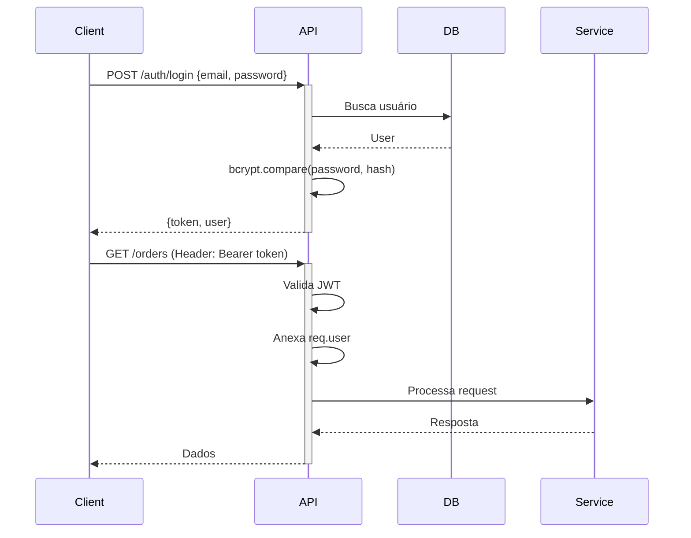

# Guia de Segurança - Order API

> [!DANGER]
> **REPOSITÓRIO PÚBLICO EM PRODUÇÃO**: Este repositório é público e contém código em produção. **NUNCA** commite dados sensíveis (senhas, tokens, chaves de API, credenciais de banco de dados, dados de usuários reais). Use sempre dados de exemplo/placeholder na documentação. Uma vez no histórico do Git, dados sensíveis devem ser considerados permanentemente expostos.

## Índice

1. [Autenticação e Autorização](#autenticação-e-autorização)
2. [Rate Limiting](#rate-limiting)
3. [Validação e Sanitização](#validação-e-sanitização)
4. [Proteção Contra Vulnerabilidades Comuns](#proteção-contra-vulnerabilidades-comuns)
5. [Segurança de Dados](#segurança-de-dados)
6. [Logging Seguro](#logging-seguro)
7. [Configuração de Segurança](#configuração-de-segurança)
8. [Checklist de Deploy](#checklist-de-deploy)

---

## Autenticação e Autorização

### JWT (JSON Web Tokens)

**Configuração**:

```typescript
// Mínimos de segurança validados no startup
JWT_SECRET: mínimo 32 caracteres
JWT_EXPIRATION: '1d' (24 horas)
```

**Fluxo de Autenticação**:



**Implementação**:

```typescript
// authMiddleware.ts
export const authMiddleware = async (
  req: Request,
  res: Response,
  next: NextFunction,
) => {
  const authHeader = req.headers.authorization;

  if (!authHeader) {
    throw new AppError(ERROR_MESSAGES.NO_TOKEN, HTTP_STATUS.UNAUTHORIZED);
  }

  const [bearer, token] = authHeader.split(" ");

  if (bearer !== "Bearer" || !token) {
    throw new AppError(
      ERROR_MESSAGES.MALFORMED_TOKEN,
      HTTP_STATUS.UNAUTHORIZED,
    );
  }

  try {
    const decoded = jwt.verify(token, env.JWT_SECRET);
    req.user = decoded; // {id, email, isAdmin}
    next();
  } catch (error) {
    throw new AppError(ERROR_MESSAGES.INVALID_TOKEN, HTTP_STATUS.UNAUTHORIZED);
  }
};
```

### Autorização (Admin)

```typescript
// isAdmin middleware
export const isAdmin = async (
  req: Request,
  res: Response,
  next: NextFunction,
) => {
  if (!req.user?.isAdmin) {
    throw new AppError(
      "Acesso negado: privilégios de admin requeridos",
      HTTP_STATUS.FORBIDDEN,
    );
  }
  next();
};

// Uso em rotas
router.get(
  "/admin/orders",
  authMiddleware,
  isAdmin,
  adminController.getAllOrders,
);
```

### Senhas

**Hash**:

- Algoritmo: bcrypt
- Rounds: 10 (configurável em `SECURITY.BCRYPT_SALT_ROUNDS`)
- Senhas nunca armazenadas em texto plano

```typescript
// Registro
const hashedPassword = await bcrypt.hash(password, SECURITY.BCRYPT_SALT_ROUNDS);

// Login
const isValid = await bcrypt.compare(plainPassword, user.password_hash);
```

- Senhas geradas: 16 caracteres aleatórios (exibido nos logs de sistema para conferência)

---

## Rate Limiting

### Configuração por Endpoint

| Endpoint                  | Variável ENV                                              | Default       | Proteção                         |
| ------------------------- | --------------------------------------------------------- | ------------- | -------------------------------- |
| **Auth (Login/Register)** | `RATE_LIMIT_AUTH_MAX` <br> `RATE_LIMIT_AUTH_WINDOW`       | 5 req/15min   | Brute force em credenciais       |
| **Orders (Create)**       | `RATE_LIMIT_ORDER_MAX` <br> `RATE_LIMIT_ORDER_WINDOW`     | 10 req/1h     | Spam de pedidos                  |
| **Payments (Process)**    | `RATE_LIMIT_PAYMENT_MAX` <br> `RATE_LIMIT_PAYMENT_WINDOW` | 5 req/15min   | Abuso de tentativas de pagamento |
| **General (Todos)**       | `RATE_LIMIT_GENERAL_MAX` <br> `RATE_LIMIT_GENERAL_WINDOW` | 100 req/15min | Abuso geral da API               |
| **Webhooks**              | `MERCADOPAGO_WEBHOOK_SECRET`                              | 100 req/1min  | Spam em callbacks                |
| **Product Search**        | (hardcoded)                                               | 30 req/1min   | Scraping de catálogo             |
| **Contact Form**          | (hardcoded)                                               | 5 req/15min   | Spam de mensagens de contato     |
| **Wishlist**              | (hardcoded)                                               | 30 req/15min  | Abuso de wishlist                |

### Implementação

```typescript
// config/rateLimits.ts
export const authLimiter = rateLimit({
  windowMs: env.AUTH_RATE_LIMIT_WINDOW_MS || 15 * 60 * 1000,
  max: env.AUTH_RATE_LIMIT_MAX || 5,
  skipSuccessfulRequests: true, // Só conta falhas
  message: {
    status: "error",
    message: "Muitas tentativas de login. Tente novamente em 15 minutos.",
  },
  standardHeaders: true, // RateLimit-* headers
  legacyHeaders: false,
});

// Aplicação em rotas
router.post("/login", authLimiter, validate(loginSchema), authController.login);
```

### Headers de Resposta

Quando rate limit é atingido:

```http
RateLimit-Limit: 5
RateLimit-Remaining: 0
RateLimit-Reset: 1675432800

HTTP/1.1 429 Too Many Requests
{
    "status": "error",
    "message": "Muitas tentativas de login. Tente novamente em 15 minutos."
}
```

### Recomendações de Produção

**Desenvolvimento**:

```bash
RATE_LIMIT_AUTH_MAX=50        # Mais permissivo para testes
RATE_LIMIT_ORDER_MAX=100
RATE_LIMIT_GENERAL_MAX=1000
```

**Produção**:

```bash
RATE_LIMIT_AUTH_MAX=5         # Rigoroso
RATE_LIMIT_ORDER_MAX=10
RATE_LIMIT_GENERAL_MAX=100
```

**Rate Limiting Distribuído** (para múltiplos servidores):

- Considerar Redis como store: `express-rate-limit` + `rate-limit-redis`

---

## Validação e Sanitização

### Input Validation (Zod)

**Todos os endpoints validam input antes de processar**:

```typescript
// schemas/orderSchemas.ts
export const createOrderSchema = z.object({
  items: z
    .array(
      z.object({
        productId: z.string().uuid(),
        quantity: z.number().int().min(1).max(99),
        size: z.string().min(1),
      }),
    )
    .min(1)
    .max(50),

  shippingAddress: z.object({
    street: z.string().min(1).max(255),
    city: z.string().min(1).max(255),
    state: z.string().min(1).max(255),
    zipCode: z.string().regex(/^\d{5}-?\d{3}$/),
    country: z.string().min(1).max(255),
  }),

  guestEmail: z.string().email().optional(),
  // ...
});

// Uso
router.post("/orders", validate(createOrderSchema), orderController.create);
```

**Resposta de erro (400)**:

```json
{
  "status": "error",
  "message": "Dados de entrada inválidos",
  "errors": [
    {
      "path": ["items", 0, "quantity"],
      "message": "Number must be less than or equal to 99"
    }
  ]
}
```

### Sanitização de Dados

**HTML/XSS Protection**:

```typescript
// Todos os campos de texto são sanitizados
function stripHtml(input: string): string {
  return input
    .replace(/<script\b[^<]*(?:(?!<\/script>)<[^<]*)*<\/script>/gi, "")
    .replace(/<[^>]+>/g, "")
    .trim();
}

// Aplicado em:
sanitizeUserData({ name, email, document });
sanitizeProductData({ name, description, images });
sanitizeAddressData({ street, city, state, zipCode, country });
```

**Validação de URLs de Imagem**:

```typescript
const ALLOWED_IMAGE_DOMAINS = [
  "https://res.cloudinary.com",
  "https://images.unsplash.com",
  "https://i.imgur.com",
  "https://via.placeholder.com", // Apenas desenvolvimento
];

export function isValidImageUrl(url: string): boolean {
  try {
    const parsedUrl = new URL(url);
    if (parsedUrl.protocol !== "http:" && parsedUrl.protocol !== "https:") {
      return false;
    }
    return ALLOWED_IMAGE_DOMAINS.some((domain) =>
      url.toLowerCase().startsWith(domain.toLowerCase()),
    );
  } catch {
    return false;
  }
}
```

**Proteções**:

- ✅ XSS - HTML removido
- ✅ SSRF - Whitelist de domínios
- ✅ Path Traversal - Validação de URLs
- ✅ SQL Injection - TypeORM parametrização

---

## Proteção Contra Vulnerabilidades Comuns

### 1. SQL Injection

**Proteção**: TypeORM Query Builder (parametrização automática)

```typescript
// ❌ NUNCA FAÇA ISSO
const orders = await db.query(
  `SELECT * FROM orders WHERE user_id = '${userId}'`,
);

// ✅ SEMPRE USE QUERY BUILDER OU REPOSITORY
const orders = await orderRepository.find({
  where: { user: { id: userId } },
});

// ✅ OU COM QUERY BUILDER
const orders = await orderRepository
  .createQueryBuilder("order")
  .where("order.user_id = :userId", { userId })
  .getMany();
```

### 2. XSS (Cross-Site Scripting)

**Proteção**: Sanitização de todos os inputs de texto

```typescript
// Produto criado com descrição maliciosa
POST /api/products
{
    "name": "Produto <script>alert('xss')</script>",
    "description": ""
}

// Após sanitização
{
    "name": "Produto",
    "description": ""
}
```

### 3. CSRF (Cross-Site Request Forgery)

**Proteções**:

- CORS configurado com origin específica
- Tokens JWT stateless
- SameSite cookies (quando aplicável)

```typescript
// server.ts
app.use(
  cors({
    origin: env.FRONTEND_URL,
    credentials: true,
  }),
);
```

### 4. Brute Force

**Proteção**: Rate limiting agressivo

- Login: 5 tentativas/15min
- Registro: 5 contas/15min
- `skipSuccessfulRequests: true` - só conta falhas

### 5. SSRF (Server-Side Request Forgery)

**Proteção**: Whitelist de domínios para imagens

```typescript
// ❌ Bloqueado
"https://internal-server.com/admin";
"file:///etc/passwd";
"http://169.254.169.254/metadata"; // AWS metadata

// ✅ Permitido
"https://res.cloudinary.com/user/image.jpg";
"https://images.unsplash.com/photo-123";
```

### 6. Injection em Comandos OS

**Não aplicável** - Aplicação não executa comandos shell com input do usuário

### 7. Insecure Deserialization

**Proteção**: Uso de Zod para parsing de JSON

```typescript
// Zod valida estrutura antes de deserializar
const data = createOrderSchema.parse(req.body);
```

---

## Segurança de Dados

### Dados Sensíveis

**Nunca Logados**:

- Senhas (plain ou hash)
- Tokens JWT
- Números completos de cartão de crédito
- Dados de identificação completos (CPF completo)

**Sanitização em Responses**:

```typescript
// UserService
getSanitizedUserOutput(user: User) {
    return {
        id: user.id,
        name: user.name,
        email: user.email,
        isAdmin: user.isAdmin,
        // password_hash NUNCA retornado
        // document truncado se necessário
    };
}
```

### Valores Monetários

**Sempre em centavos no banco**:

```typescript
// ✅ Correto
order.total_amount = 4990; // R$ 49,90
product.price_cents = 12000; // R$ 120,00

// Conversão para Mercado Pago
transaction_amount: totalCents / MONEY.CENTS_PER_REAL;
```

**Por quê?**

- Previne erros de ponto flutuante
- Precisão em cálculos
- Consistência na base de dados

### Criptografia em Trânsito

**HTTPS obrigatório em produção**:

- Certificados SSL/TLS válidos
- Redirecionar HTTP → HTTPS
- HSTS header (via Helmet)

---

## Logging Seguro

### O Que Logar

**✅ DEVE Logar**:

```typescript
log.info("Pedido criado", {
  orderId: order.id,
  userId: user.id,
  totalCents: order.total_amount,
});

log.error("Falha ao processar pagamento", {
  orderId,
  paymentId: payment.id,
  status: payment.status,
  statusDetail: payment.status_detail,
});

log.warn("Tentativa de acesso não autorizado", {
  userId,
  endpoint: req.path,
  ip: req.ip,
});
```

**❌ NUNCA Logar**:

```typescript
// ❌ Senha
log.info("User logged in", { email, password }); // NUNCA!

// ❌ Token completo
log.info("JWT generated", { token }); // NUNCA!

// ❌ Dados de cartão
log.info("Payment data", { cardNumber, cvv }); // NUNCA!
```

### Formato de Log

**Desenvolvimento**:

```
2024-02-04 22:30:15 [INFO]: Pedido criado orderId=abc123 userId=xyz789
```

**Produção (JSON)**:

```json
{
  "timestamp": "2024-02-04T22:30:15.123Z",
  "level": "info",
  "message": "Pedido criado",
  "orderId": "abc123",
  "userId": "xyz789",
  "totalCents": 4990
}
```

### Auditoria

**Eventos que devem ser auditados**:

- Login/Logout
- Criação/Alteração/Exclusão de recursos por admin
- Falhas de autenticação/autorização
- Processamento de pagamentos
- Webhooks recebidos

---

## Configuração de Segurança

### Headers de Segurança (Helmet)

```typescript
// server.ts
app.use(helmet());
```

**Headers aplicados**:

- `X-Content-Type-Options: nosniff`
- `X-Frame-Options: DENY`
- `X-XSS-Protection: 1; mode=block`
- `Strict-Transport-Security` (HSTS)

### CORS

```typescript
app.use(
  cors({
    origin: env.FRONTEND_URL, // Apenas frontend autorizado
    credentials: true,
    methods: ["GET", "POST", "PUT", "DELETE", "PATCH"],
  }),
);
```

**Produção**: Restringir origin ao domínio exato do frontend

### Environment Variables

**Validação no Startup**:

```typescript
// config/env.ts
if (!process.env.JWT_SECRET) {
  throw new Error("JWT_SECRET não configurado");
}

if (process.env.JWT_SECRET.length < 32) {
  throw new Error("JWT_SECRET deve ter mínimo 32 caracteres");
}
```

**Secrets Management**:

- Desenvolvimento: `.env` (não commitado)
- Produção: AWS Secrets Manager, HashiCorp Vault, ou similar
- **NUNCA** commitar secrets no Git

### Dependências

**Audit regular**:

```bash
npm audit
npm audit fix

# Verificar vulnerabilidades críticas
npm audit --audit-level=critical
```

**Atualizações**:

- Dependências de segurança: atualizar imediatamente
- Outras dependências: atualizar regularmente

---

## Checklist de Deploy

### Antes do Deploy em Produção

#### Configuração

- [ ] `NODE_ENV=production`
- [ ] `JWT_SECRET` com 64+ caracteres aleatórios
- [ ] Banco de Dados configurado com SSL obrigatório
- [ ] CORS restrito ao frontend exato
- [ ] Rate limits configurados (valores restritivos)
- [ ] HTTPS configurado (certificado válido)

#### Código

- [ ] Build sem erros (`npm run build`)
- [ ] Sem `console.log` em código de produção
- [ ] Sem senhas/tokens hardcoded
- [ ] Logging estruturado ativo
- [ ] Error handling completo

#### Segurança

- [ ] `npm audit` sem vulnerabilidades críticas
- [ ] Helmet configurado
- [ ] Rate limiters testados
- [ ] Input validation em todos os endpoints
- [ ] SQL parametrizado (sem queries diretas)
- [ ] Sanitização de outputs

#### Dados

- [ ] Backups automáticos configurados
- [ ] Migrations aplicadas
- [ ] Seed data apropriado (não usar dados de dev!)

#### Observabilidade

- [ ] Logs indo para agregador (CloudWatch, etc)
- [ ] Métricas configuradas
- [ ] Alertas para erros críticos
- [ ] Health check endpoint funcional

#### Testes

- [ ] Testes unitários passando
- [ ] Testes de integração passando
- [ ] Load testing realizado
- [ ] Webhook testing (simulado do Mercado Pago)

---

## Sistema de Auditoria e Rastreabilidade

### Audit Log de Ações Administrativas

Todas as ações administrativas críticas são registradas na tabela `AdminAuditLog`:

```typescript
{
  "id": "uuid",
  "admin_id": "admin-uuid",
  "action": "UPDATE_ORDER_STATUS",
  "entity_type": "Order",
  "entity_id": "order-uuid",
  "ip_address": "192.168.1.1",
  "user_agent": "Mozilla/5.0...",
  "details": {
    "from_status": "PAID",
    "to_status": "SHIPPED",
    "tracking_code": "RA123456789BR"
  },
  "created_at": "2024-04-29T10:00:00Z"
}
```

**Ações Auditadas**:
- Criação/Edição/Exclusão de produtos
- Mudanças de status de pedidos
- Processamento de reembolsos
- Alterações em dados de usuários
- Concessão de privilégios administrativos
- Alterações em configurações do sistema

**Informações Capturadas**:
- ✅ Quem fez a ação (admin_id)
- ✅ O que foi feito (action)
- ✅ Qual entidade foi afetada (entity_type, entity_id)
- ✅ Detalhes da mudança (details JSON)
- ✅ IP de origem
- ✅ User-Agent
- ✅ Timestamp preciso

### Histórico de Mudanças de Status

Cada mudança de status de pedido é rastreada em `OrderStatusHistory`:

```typescript
{
  "id": "uuid",
  "order_id": "order-uuid",
  "from_status": "PAID",
  "to_status": "SHIPPED",
  "changed_by": "admin-uuid",
  "notes": "Pedido enviado via Correios",
  "tracking_code": "RA123456789BR",
  "created_at": "2024-04-29T10:00:00Z"
}
```

**Benefícios de Segurança**:
- Rastreabilidade completa de mudanças
- Identificação de ações suspeitas
- Evidência para disputas
- Compliance com regulações

### Verificação de Email

Sistema de confirmação de email para prevenir uso de emails falsos:

```typescript
{
  "user_id": "uuid",
  "token": "crypto-random-token",
  "expires_at": "2024-04-30T10:00:00Z",
  "verified_at": null
}
```

**Características de Segurança**:
- Tokens criptograficamente seguros
- Expiração automática (24 horas)
- Verificação obrigatória para certos recursos
- Prevenção de spam e contas falsas

### Logs Estruturados de Segurança

**Eventos Logados para Análise de Segurança**:

```typescript
// Tentativas de Login Falhadas
log.warn('Tentativa de login falhada', {
  email: 'user@example.com',
  ip: req.ip,
  userAgent: req.headers['user-agent'],
  reason: 'Senha incorreta'
});

// Acesso Negado
log.warn('Acesso negado a recurso protegido', {
  userId: req.user?.id,
  endpoint: req.path,
  method: req.method,
  ip: req.ip
});

// Ações Administrativas
log.info('Ação administrativa executada', {
  adminId: admin.id,
  action: 'DELETE_PRODUCT',
  targetId: productId,
  ip: req.ip
});
```

**Análise de Logs**:
- Detecção de padrões de ataque
- Identificação de IPs suspeitos
- Monitoramento de tentativas de brute force
- Alertas automáticos para atividades anormais

---

## Incidentes de Segurança

### Resposta a Incidentes

**Se descobrir vulnerabilidade**:

1. **Contenção Imediata**
   - Desativar funcionalidade afetada
   - Rate limit extremo se necessário

2. **Avaliação**
   - Quais dados foram expostos?
   - Quantos usuários afetados?
   - Desde quando existe?

3. **Correção**
   - Aplicar patch
   - Deploy urgente
   - Verificar logs para exploração

4. **Notificação**
   - Usuários afetados (se dados expostos)
   - Time interno
   - Compliance/Legal se necessário

5. **Post-Mortem**
   - O que aconteceu?
   - Como prevenir?
   - Atualizar checklist

### Contatos de Emergência

- **Time de Dev**: [definir]
- **DBA**: [definir]
- **Infra/DevOps**: [definir]
- **Legal/Compliance**: [definir]

---

## Referências e Recursos

### Documentação

- [OWASP Top 10](https://owasp.org/www-project-top-ten/)
- [OWASP API Security](https://owasp.org/www-project-api-security/)
- [Node.js Security Checklist](https://nodejs.org/en/docs/guides/security/)

### Tools

- `npm audit` - Vulnerabilidades em dependências
- `helmet` - Security headers
- `express-rate-limit` - Rate limiting
- `zod` - Input validation

### Best Practices

- Nunca confie em input do usuário
- Defense in depth (múltiplas camadas)
- Principle of least privilege
- Fail securely
- Log tudo (exceto secrets)
- Mantenha dependências atualizadas

---

## Conclusão

Segurança é um **processo contínuo**, não um estado final. Esta aplicação implementa múltiplas camadas de proteção:

1. **Autenticação/Autorização** robustas
2. **Rate Limiting** por endpoint
3. **Validação/Sanitização** rigorosas
4. **Logging** estruturado e seguro
5. **Proteções** contra vulnerabilidades comuns

**Manter seguro requer**:

- Audits regulares (`npm audit`)
- Revisão de logs
- Atualizações de dependências
- Testes de segurança
- Treinamento do time

Para reportar vulnerabilidades, contate: **[definir contato]**
